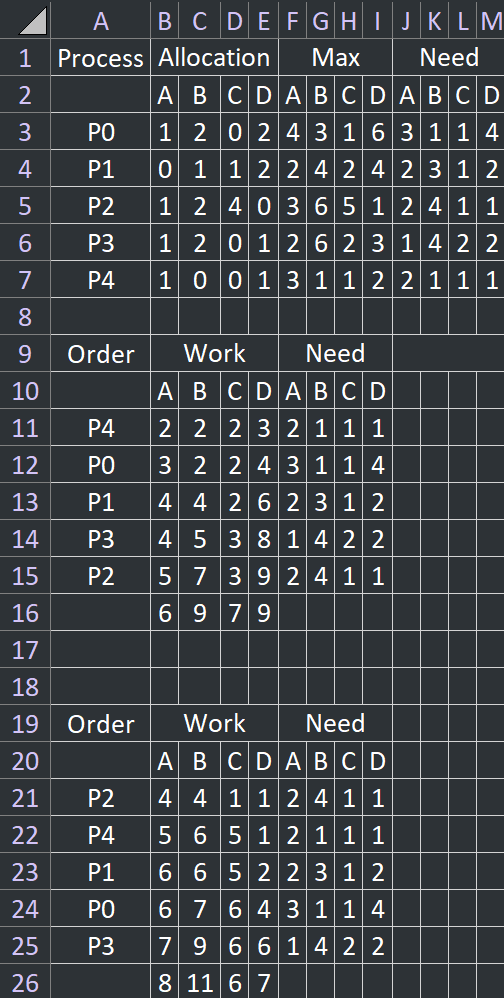

# 2024S Operating System HW3

## Chapter 7

> - 7.8 The Linux kernel has a policy that a process cannot hold a spinlock while attempting to acquire a semaphore.
    > Explain why this policy is in place.

Ans: Potential deadlock. If a Process holding spinlock tries to acquire a semaphore held by another process, and that
process is waiting for the spinlock held by the first process, a deadlock will occur.

## Chapter 8

> - 8.20: In a real computer system, neither the resources available nor the demands of processes for resources are
    > consistent over long periods (months). Resources break or are replaced, new processes come and go, and new resources
    > are bought and added to the system.
> - If deadlock is controlled by the banker’s algorithm, which of the following changes can be made safely (without
    > introducing the possibility of deadlock), and under what circumstances?
    >

- (a) Increase Available (new resources added).

> - (b) Decrease Available (resource permanently
    > removed from system).
>   - (c) Increase Max for one process (the process
      > needs or wants more resources than allowed).\
>   - (d) Decrease Max for one process (the process
      > decides that it does not need that many
      > resources).
>   - (e) Increase the number of processes.
>   - (f) Decrease the number of processes.

Ans:

- (a) Increase Available: Safe. The system has more resources to allocate to processes.
- (b) Decrease Available: Unsafe. The resources could no longer enough to satisfy the needs of all processes.
- (c) Increase Max for one process: Unsafe. The process could request more resources than the system can provide.
- (d) Decrease Max for one process: Safe. The process can request fewer resources.
- (e) Increase the number of processes: Unsafe. The process could request more resources than available.
- (f) Decrease the number of processes: Safe. Fewer processes need resources.

> 8.27: Consider the following snapshot of a system :
> Use the banker’s algorithm, determine whether or not each of the following states is unsafe. If the state is safe, illustrate the order in which the processes may complete. Otherwise, illustrate why the state is unsafe.
>
> - (a) Available=(2,2,2,3)
> - (b) Available=(4,4,1,1)

Ans:


> 8.30: A single-lane bridge connects the two Vermont villages of North Tunbridge and South Tunbridge. Farmers in the two villages use this bridge to deliver their produce to the neighbor town.
>
> - The bridge can become deadlocked if a northbound and a southbound farmer get on the bridge at the same time. (Vermont farmers are stubborn and are unable to back up.)
> - Using semaphores and/or mutex locks, design an algorithm in pseudocode that prevents deadlock.
> - Initially, do not be concerned about starvation (the situation in which northbound farmers prevent southbound farmers from using the bridge, or vice versa).

Ans:

```pycon
mutex bridge = 1;

def crossBridge(farmer, dir): # Called Whenever a farmer, from both villages, trying to cross the bridge.
    mutex_lock(&bridge);
    farmer.cross(dir);
    mutex_unlock(&bridge);

```

> – 9.15: Compare the memory organization schemes of contiguous memory allocation and paging with respect to the following issues:
> - (a) external fragmentation
> - (b) internal fragmentation
> - (c) ability to share code across processes

Ans:
(a) 外部碎片化方面:

- 固定分區的連續分配不會產生外部碎片
- 可變分區的連續分配會產生外部碎片
- 分頁制不會有外部碎片問題
- 分段制會產生外部碎片問題

(b) 內部碎片化方面:
- 分段制和可變分區連續分配不會有內部碎片
- 固定分區連續分配和分頁制皆可能產生內部碎片,若分區/頁框未完全填滿

(c) 程序間共享代碼能力:
- 連續分配無法支援程式碼共享
- 在分段制中,只要不混合程式碼和資料,可輕易共享程式碼
- 分頁制中,透過對應相同的實體頁框,即可實現共享程式碼,但需防止頁框含有不應共享的資料

>  Consider a computer system with a 32- bit logical address and 8-KB page size. The system supports up to 1 GB of physical memory. How many entries are there in each of the following?
> - a. A conventional single-level page table?
> - b. An inverted page table?

Ans:
- a. A conventional single-level page table:
  - 32-bit logical address, 8-KB page size, 1 GB of physical memory.
  - 32-bit logical address, 2^32 = 4 GB of logical address space.
  - 4 GB / 8 KB = 2^32 / 2^13 = 2^19 = 524,288 pages.
  - 1 GB / 8 KB = 2^30 / 2^13 = 2^17 = 131,072 frames.
  - 524,288($2^{19}$) entries in the page table.

- b. An inverted page table:
- 1 GB of physical memory, 8-KB page size.
- 1 GB / 8 KB = 2^30 / 2^13 = 2^17 = 131,072 frames.
